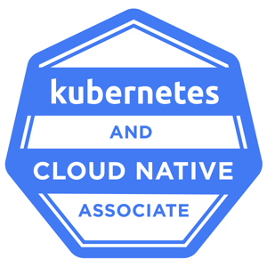

---

## Certifications

## Toolbox

## Stats

<picture>
  <source media="(prefers-color-scheme: dark)" srcset="https://github-readme-stats-fast.vercel.app/api?username=Braundo&custom_title=Braundo+GitHub+Stats&hide_rank=true&show_icons=true&hide_border=true&bg_color=00000000&title_color=526cfe&icon_color=8ea1ff&text_color=8b949e" />
  
</picture>

 
<picture>
  <source media="(prefers-color-scheme: dark)" srcset="https://streak-stats.demolab.com?user=Braundo&hide_border=true&background=00000000&ring=526cfe&fire=8ea1ff&currStreakLabel=8b949e&sideLabels=8b949e&currStreakNum=8b949e&sideNums=8b949e&dates=8b949e" />
  
</picture>

